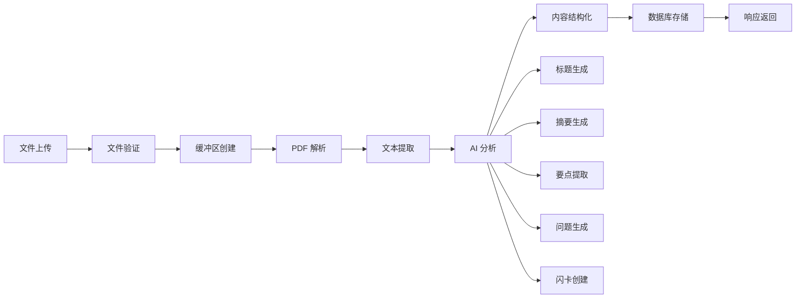

# MangoNote 技术架构文档

## 系统整体架构

### 架构概览
```
┌─────────────────────────────────────────────────────────────┐
│                      前端层 (Frontend)                        │
├─────────────────────────────────────────────────────────────┤
│  Next.js 14 + React 18 + TypeScript                       │
│  • 用户界面组件 (UI Components)                               │
│  • 页面路由 (App Router)                                     │
│  • 状态管理 (Client State)                                   │
│  • 模态框系统 (Modal System)                                 │
└─────────────────────────────────────────────────────────────┘
                              │
                        HTTP/API 调用
                              │
┌─────────────────────────────────────────────────────────────┐
│                      API 层 (Backend API)                   │
├─────────────────────────────────────────────────────────────┤
│  Next.js API Routes                                        │
│  • PDF 处理端点 (/api/pdf/upload)                            │
│  • 音频处理端点 (/api/audio/*)                              │
│  • YouTube 处理端点 (/api/youtube/*)                        │
│  • 笔记管理端点 (/api/notes/*)                              │
└─────────────────────────────────────────────────────────────┘
                              │
                         数据库查询 & AI 调用
                              │
┌─────────────────────────────────────────────────────────────┐
│                   服务层 (Service Layer)                    │
├─────────────────────────────────────────────────────────────┤
│  • AI 内容分析服务 (AIService)                               │
│  • PDF 文本提取服务 (pdf-parse)                              │
│  • 数据库连接服务 (PostgreSQL)                               │
│  • 文件存储服务 (File Storage)                               │
└─────────────────────────────────────────────────────────────┘
                              │
                          数据持久化
                              │
┌─────────────────────────────────────────────────────────────┐
│                     数据层 (Data Layer)                     │
├─────────────────────────────────────────────────────────────┤
│  PostgreSQL 数据库                                          │
│  • users (用户表)                                           │
│  • notes (笔记表)                                           │
│  • content_blocks (内容块表)                                │
│  • flashcards (闪卡表)                                      │
│  • folders (文件夹表)                                       │
└─────────────────────────────────────────────────────────────┘
```

## 前端架构详解

### 1. 页面路由结构
```
src/app/
├── layout.tsx                  # 根布局组件
├── page.tsx                    # 着陆页
├── globals.css                 # 全局样式
├── dashboard/
│   └── page.tsx               # 仪表板页面
├── notes/
│   └── [id]/
│       └── page.tsx           # 动态笔记详情页
├── auth/
│   ├── signin/
│   │   └── page.tsx           # 登录页面
│   └── signup/
│       └── page.tsx           # 注册页面
├── processing/
│   └── page.tsx               # 处理状态页面
└── api/                       # API 路由
    ├── pdf/
    │   └── upload/
    │       └── route.ts       # PDF 上传处理
    └── auth/
        └── [...nextauth]/
            └── route.ts       # 认证处理 (计划中)
```

### 2. 组件架构
```
src/components/
├── Sidebar.tsx                # 侧边栏导航组件
├── modals/                    # 模态框组件集合
│   ├── RecordAudioModal.tsx   # 录音模态框
│   ├── UploadAudioModal.tsx   # 音频上传模态框
│   ├── UploadPDFModal.tsx     # PDF 上传模态框
│   └── YoutubeVideoModal.tsx  # YouTube 视频模态框
├── ui/                        # 基础 UI 组件 (计划扩展)
│   ├── Button.tsx
│   ├── Input.tsx
│   ├── Modal.tsx
│   └── Card.tsx
└── features/                  # 功能特定组件 (计划扩展)
    ├── notes/
    ├── flashcards/
    └── dashboard/
```

### 3. 状态管理策略
```typescript
// 当前: React 内置状态管理
const [activeModal, setActiveModal] = useState<string | null>(null)
const [selectedFile, setSelectedFile] = useState<File | null>(null)
const [isUploading, setIsUploading] = useState(false)

// 未来扩展: Context API 或状态管理库
interface AppState {
  user: User | null
  notes: Note[]
  currentNote: Note | null
  uiState: {
    activeModal: string | null
    isLoading: boolean
  }
}
```

## 后端 API 架构

### 1. API 端点设计

#### PDF 处理 API
```typescript
// /api/pdf/upload/route.ts
export async function POST(request: NextRequest) {
  // 1. 请求验证和文件提取
  const formData = await request.formData()
  const file = formData.get('pdf') as File
  
  // 2. 文件验证
  if (!file || file.type !== 'application/pdf') {
    return NextResponse.json({ error: '...' }, { status: 400 })
  }
  
  // 3. PDF 文本提取
  const buffer = Buffer.from(await file.arrayBuffer())
  const pdfData = await pdfParse(buffer)
  
  // 4. AI 内容分析
  const aiService = new AIService()
  const analysisResult = await aiService.analyzeContent(pdfData.text)
  
  // 5. 数据库存储
  const noteId = uuidv4()
  await query(`INSERT INTO notes ...`, [...])
  
  // 6. 响应返回
  return NextResponse.json({ success: true, data: { note, ... } })
}
```

#### 音频处理 API (规划中)
```typescript
// /api/audio/upload/route.ts
export async function POST(request: NextRequest) {
  // 1. 音频文件接收和验证
  // 2. 语音转文字 (Whisper API)
  // 3. AI 内容分析
  // 4. 数据库存储
  // 5. 响应返回
}

// /api/audio/transcribe/route.ts  
export async function POST(request: NextRequest) {
  // 实时转录接口
}
```

#### YouTube 处理 API (规划中)
```typescript
// /api/youtube/process/route.ts
export async function POST(request: NextRequest) {
  // 1. YouTube URL 验证
  // 2. 视频信息获取
  // 3. 字幕提取 (youtube-dl 或 YouTube API)
  // 4. AI 内容分析
  // 5. 数据库存储
}
```

### 2. 数据流处理

#### PDF 处理流水线


#### 错误处理机制
```typescript
try {
  // 核心处理逻辑
} catch (error) {
  console.error('Processing error:', error)
  
  // 分类错误处理
  if (error instanceof PDFError) {
    return NextResponse.json({ error: 'PDF parsing failed' }, { status: 400 })
  } else if (error instanceof DatabaseError) {
    return NextResponse.json({ error: 'Database error' }, { status: 500 })
  } else {
    return NextResponse.json({ error: 'Internal server error' }, { status: 500 })
  }
}
```

## 数据库架构设计

### 1. 数据模型关系图
```
┌─────────────┐     ┌──────────────┐     ┌─────────────────┐
│   users     │     │   folders    │     │   notes         │
├─────────────┤     ├──────────────┤     ├─────────────────┤
│ id (PK)     │────▶│ user_id (FK) │     │ id (PK)         │
│ email       │     │ name         │     │ user_id (FK)    │
│ full_name   │     │ color        │     │ folder_id (FK)  │
│ avatar_url  │     │ icon         │     │ title           │
│ created_at  │     └──────────────┘     │ source_type     │
│ is_guest    │                          │ content_status  │
└─────────────┘     ┌──────────────┐     │ transcription   │
                    │ flashcards   │     │ created_at      │
┌─────────────────┐ ├──────────────┤     └─────────────────┘
│ content_blocks  │ │ id (PK)      │              │
├─────────────────┤ │ note_id (FK) │──────────────┘
│ id (PK)         │ │ user_id (FK) │
│ note_id (FK)    │─│ question     │
│ type            │ │ answer       │
│ icon            │ │ created_at   │
│ icon_color      │ └──────────────┘
│ title           │
│ content (JSON)  │
│ sort_order      │
└─────────────────┘
```

### 2. 表结构详细定义

#### 用户表 (users)
```sql
CREATE TABLE users (
    id UUID PRIMARY KEY DEFAULT gen_random_uuid(),
    email VARCHAR(255) UNIQUE NOT NULL,
    full_name VARCHAR(255),
    avatar_url TEXT,
    created_at TIMESTAMP DEFAULT NOW(),
    updated_at TIMESTAMP DEFAULT NOW(),
    is_guest BOOLEAN DEFAULT FALSE,
    last_active_at TIMESTAMP DEFAULT NOW()
);
```

#### 笔记表 (notes)
```sql
CREATE TABLE notes (
    id UUID PRIMARY KEY DEFAULT gen_random_uuid(),
    user_id UUID REFERENCES users(id) ON DELETE CASCADE,
    folder_id UUID REFERENCES folders(id) ON DELETE SET NULL,
    title VARCHAR(500) NOT NULL,
    source_type VARCHAR(50) NOT NULL, -- 'import', 'record', 'youtube', 'manual'
    content_status VARCHAR(50) DEFAULT 'processing', -- 'processing', 'completed', 'failed'
    created_at TIMESTAMP DEFAULT NOW(),
    updated_at TIMESTAMP DEFAULT NOW(),
    url TEXT, -- 原始 URL (YouTube 等)
    transcription TEXT, -- 完整转录文本
    image_url TEXT, -- 封面图片
    markdown TEXT -- Markdown 格式内容
);
```

#### 内容块表 (content_blocks)
```sql
CREATE TABLE content_blocks (
    id UUID PRIMARY KEY DEFAULT gen_random_uuid(),
    note_id UUID REFERENCES notes(id) ON DELETE CASCADE,
    type VARCHAR(50) NOT NULL, -- 'summary', 'key_points', 'questions', 'mindmap'
    icon VARCHAR(10),
    icon_color VARCHAR(20),
    title VARCHAR(255) NOT NULL,
    content JSONB NOT NULL, -- 灵活的内容存储
    sort_order INTEGER DEFAULT 0
);
```

#### 闪卡表 (flashcards)
```sql
CREATE TABLE flashcards (
    id UUID PRIMARY KEY DEFAULT gen_random_uuid(),
    note_id UUID REFERENCES notes(id) ON DELETE CASCADE,
    user_id UUID REFERENCES users(id) ON DELETE CASCADE,
    question TEXT NOT NULL,
    answer TEXT NOT NULL,
    created_at TIMESTAMP DEFAULT NOW()
);
```

### 3. 数据库连接和操作

#### 连接池配置
```typescript
// src/lib/database.ts
import { Pool } from 'pg'

const pool = new Pool({
  connectionString: process.env.DATABASE_URL,
  ssl: process.env.NODE_ENV === 'production' ? { rejectUnauthorized: false } : false,
  max: 20, // 最大连接数
  idleTimeoutMillis: 30000, // 空闲超时
  connectionTimeoutMillis: 2000, // 连接超时
})

export async function query(text: string, params?: any[]) {
  const client = await pool.connect()
  try {
    const result = await client.query(text, params)
    return result
  } finally {
    client.release()
  }
}
```

#### 查询优化策略
```sql
-- 索引优化
CREATE INDEX idx_notes_user_id ON notes(user_id);
CREATE INDEX idx_notes_created_at ON notes(created_at DESC);
CREATE INDEX idx_content_blocks_note_id ON content_blocks(note_id);
CREATE INDEX idx_flashcards_note_id ON flashcards(note_id);
CREATE INDEX idx_flashcards_user_id ON flashcards(user_id);

-- 复合索引
CREATE INDEX idx_notes_user_status ON notes(user_id, content_status);
CREATE INDEX idx_content_blocks_note_sort ON content_blocks(note_id, sort_order);
```

## AI 服务架构

### 1. AI 服务接口设计
```typescript
// src/lib/ai-service.ts
export interface AIService {
  analyzeContent(text: string): Promise<AnalysisItem[]>
  generateFlashcards(text: string): Promise<Flashcard[]>
  generateMindMap(text: string): Promise<MindMapData>
  generateQuiz(text: string): Promise<Question[]>
  summarizeContent(text: string, options?: SummaryOptions): Promise<string>
}
```

### 2. 当前实现 (Mock 服务)
```typescript
export class AIService implements AIServiceInterface {
  async analyzeContent(text: string): Promise<AnalysisItem[]> {
    // 模拟 AI 分析逻辑
    return [
      {
        type: 'title',
        title: 'Document Title',
        content: { title: this.extractTitle(text) }
      },
      {
        type: 'summary',
        title: 'Summary', 
        content: { text: this.generateSummary(text) },
        icon: '📄',
        icon_color: '#3B82F6'
      },
      // ... 其他内容块
    ]
  }
  
  private extractTitle(text: string): string {
    // 简单标题提取逻辑
    const firstLine = text.split('\n')[0].trim()
    return firstLine.length > 0 && firstLine.length < 100 
      ? firstLine 
      : text.substring(0, 50).trim() + '...'
  }
}
```

### 3. 未来集成计划
```typescript
// OpenAI 集成
export class OpenAIService implements AIServiceInterface {
  private openai: OpenAI
  
  constructor() {
    this.openai = new OpenAI({
      apiKey: process.env.OPENAI_API_KEY
    })
  }
  
  async analyzeContent(text: string): Promise<AnalysisItem[]> {
    const response = await this.openai.chat.completions.create({
      model: "gpt-4",
      messages: [
        {
          role: "system",
          content: "You are an AI assistant that analyzes text content..."
        },
        {
          role: "user", 
          content: text
        }
      ],
      functions: [...] // 结构化输出定义
    })
    
    return this.parseResponse(response)
  }
}
```

## 性能和扩展性

### 1. 性能优化策略

#### 前端优化
```typescript
// 代码分割和懒加载
const UploadPDFModal = lazy(() => import('@/components/modals/UploadPDFModal'))
const YoutubeVideoModal = lazy(() => import('@/components/modals/YoutubeVideoModal'))

// 图片优化
import Image from 'next/image'

// 缓存策略
export const metadata = {
  title: 'MangoNote',
  description: '...',
  openGraph: { ... }
}
```

#### 后端优化
```typescript
// API 响应缓存
export async function GET() {
  return NextResponse.json(data, {
    headers: {
      'Cache-Control': 'public, max-age=3600, stale-while-revalidate=86400'
    }
  })
}

// 流式文件处理
export async function POST(request: NextRequest) {
  const stream = request.body
  // 流式处理大文件，避免内存溢出
}
```

### 2. 可扩展性设计

#### 微服务架构 (未来规划)
```
┌─────────────┐    ┌─────────────┐    ┌─────────────┐
│   Web App   │    │  Auth API   │    │  File API   │
│  (Next.js)  │───▶│  (Node.js)  │    │  (Node.js)  │
└─────────────┘    └─────────────┘    └─────────────┘
                           │                    │
┌─────────────┐    ┌─────────────┐    ┌─────────────┐
│   AI API    │    │  Notes API  │    │ Storage API │
│  (Python)   │    │  (Node.js)  │    │  (Cloud)    │
└─────────────┘    └─────────────┘    └─────────────┘
```

#### 数据库分片策略
```sql
-- 用户分片
CREATE TABLE users_shard_1 AS SELECT * FROM users WHERE id % 4 = 0;
CREATE TABLE users_shard_2 AS SELECT * FROM users WHERE id % 4 = 1;
-- ...

-- 时间分片  
CREATE TABLE notes_2024_q1 AS SELECT * FROM notes WHERE created_at >= '2024-01-01' AND created_at < '2024-04-01';
-- ...
```

## 安全架构

### 1. 数据安全
```typescript
// 输入验证和清理
const validatePDFFile = (file: File): boolean => {
  return file.type === 'application/pdf' && 
         file.size <= 10 * 1024 * 1024 && 
         file.name.length <= 255
}

// SQL 注入防护
const result = await query(
  'SELECT * FROM notes WHERE user_id = $1 AND id = $2',
  [userId, noteId]
)
```

### 2. 认证和授权 (计划中)
```typescript
// JWT 令牌验证
export async function verifyToken(token: string): Promise<User | null> {
  try {
    const payload = jwt.verify(token, process.env.JWT_SECRET!)
    return payload as User
  } catch (error) {
    return null
  }
}

// 权限中间件
export function requireAuth(handler: NextApiHandler): NextApiHandler {
  return async (req, res) => {
    const token = req.headers.authorization?.replace('Bearer ', '')
    const user = await verifyToken(token || '')
    
    if (!user) {
      return res.status(401).json({ error: 'Unauthorized' })
    }
    
    req.user = user
    return handler(req, res)
  }
}
```

## 监控和日志

### 1. 应用监控
```typescript
// 性能监控
console.time('pdf-processing')
await processPDF(file)
console.timeEnd('pdf-processing')

// 错误追踪
try {
  // 业务逻辑
} catch (error) {
  console.error('Error details:', {
    error: error.message,
    stack: error.stack,
    timestamp: new Date().toISOString(),
    userId: req.user?.id,
    fileInfo: { name: file.name, size: file.size }
  })
}
```

### 2. 业务指标
```typescript
// 用户行为追踪
const trackEvent = (event: string, properties: any) => {
  console.log('Analytics:', {
    event,
    properties,
    timestamp: new Date().toISOString()
  })
}

// 使用示例
trackEvent('pdf_upload_started', { fileSize: file.size })
trackEvent('note_created', { noteId, processingTime })
```

---

本技术架构文档详细描述了 MangoNote 项目的技术实现方案，为开发团队提供了清晰的架构指导和实现参考。